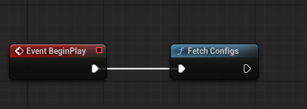
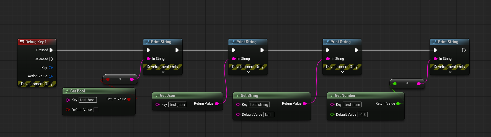

# KRoll Unreal SDK

⚠️ Proof of concept
This SDK is an experimental Unreal Engine integration used to validate remote config consumption and SDK structure. It is not production-ready.

Read values from KRoll to Unreal

## Supported values
- bool
- number (int/float)
- string
- json

## Usage
### 1. Fetch

Fetch configs at start (can be opt-in automatically in KRoll Project Settings):



### 2. Consume



### C++ equivalent

Include:
```
#include "KRollAPI.h"
```

Use:
```
FKRollAPI::FetchConfigs();
```

```
bool Enabled = FKRollAPI::GetBool("feature_x", false);
double Speed = FKRollAPI::GetNumber("speed", 1.0);
FString Name = FKRollAPI::GetString("name", "default");
```

## Setup

- Clone and copy inside the Plugin folder of your game.
- Enable the KRoll plugin
- Configure host and API key in Project Settings → KRoll
